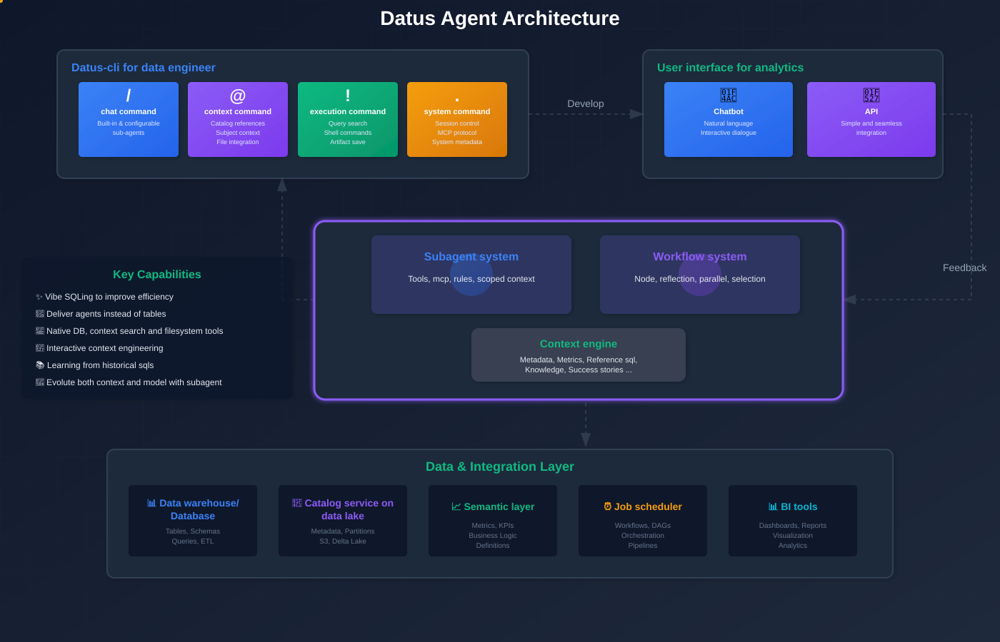

# Datus

通用数据智能平台 monorepo，整合 Agent 后端、Vue 3 前端、多数据库适配器与权限控制，支持自然语言数据问答、SQL 生成和可部署的数据应用。

<p align="center">
  <strong>Ask data questions. Generate trusted SQL. Ship governed data agents.</strong>
</p>

<p align="center">
  <a href="./datus-agent"></a>
  <a href="./datus-web"></a>
  <a href="./datus-db-adapters"></a>
  <a href="./datus-agent"></a>
  <a href="./datus-agent/LICENSE"></a>
</p>



## What You Can Build

- 自然语言数据问答和上下文增强的 SQL 生成。
- 面向团队和应用的数据工作区、权限控制和可部署 API。
- 可插拔的数据库、语义层和存储适配器。
- 面向数据工程师、分析师和业务应用的 Agent / Web / MCP 使用形态。

## Repository Layout

| Project | Purpose | Stack |
| --- | --- | --- |
| [`datus-agent`](./datus-agent) | Agent runtime、API、CLI、工作流引擎、知识库和权限能力 | Python, FastAPI |
| [`datus-web`](./datus-web) | 面向聊天、数据源、权限和管理流程的 Web 工作区 | Vue 3, Vite, TypeScript |
| [`datus-db-adapters`](./datus-db-adapters) | PostgreSQL、MySQL、ClickHouse、Oracle 等数据库适配器 | Python, uv |
| [`datus-storage-adapters`](./datus-storage-adapters) | 关系型和向量存储后端适配器 | Python, uv |

根目录只保留跨项目协调文件。具体开发、测试和启动方式以各子项目自己的 `README.md` / `AGENTS.md` 为准。

## Quick Start

开发部署、前后端联调、企业模式、mock userinfo、Bearer token、API smoke 和常见故障处理见：

- [Datus 开发部署手册](./DEVELOPMENT_DEPLOYMENT_GUIDE.zh.md)

也可以分别启动子项目：

```bash
git clone git@github.com:astenir/datus.git
cd datus

cd datus-agent
uv sync --dev
uv run datus-api --help

cd ../datus-web
npm install
npm run dev
```

## Common Commands

### 后端

```bash
cd datus-agent
uv sync --dev
uv run ruff check .
uv run pytest
```

### 数据库适配器

```bash
cd datus-db-adapters
uv sync --dev
uv run ruff check .
uv run pytest --import-mode=importlib datus-postgresql/tests/unit
```

### 存储适配器

```bash
cd datus-storage-adapters
uv sync --dev
uv run ruff check .
uv run pytest
```

### 前端

```bash
cd datus-web
npm install
npm test
npm run build
```

## Maintenance Notes

- 不在根目录新增业务代码；业务代码放回对应子项目。
- 不提交真实密钥、token、数据库密码或本地私有配置。
- 不提交生成产物、虚拟环境、依赖目录、测试缓存或构建缓存。
- 子项目内已有规则优先级高于根目录说明。
