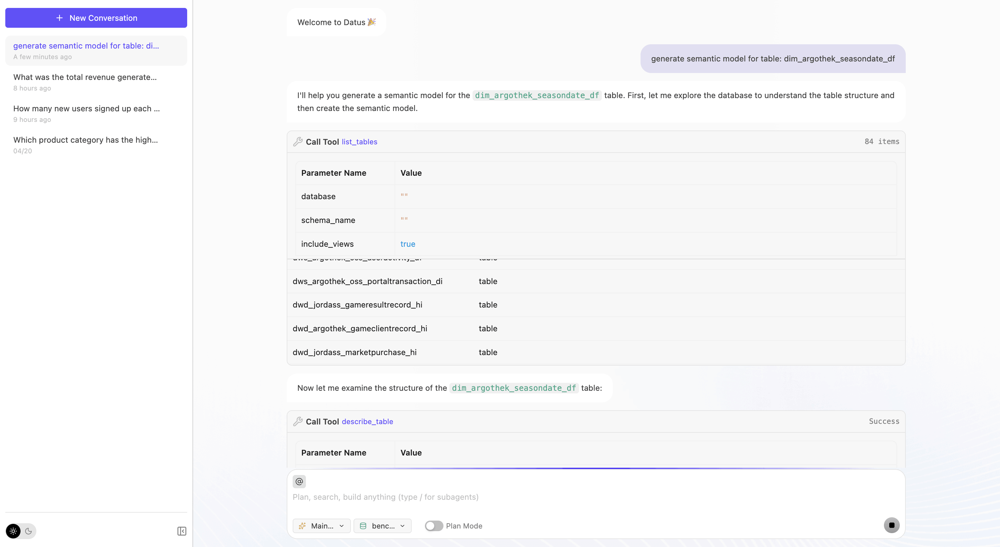
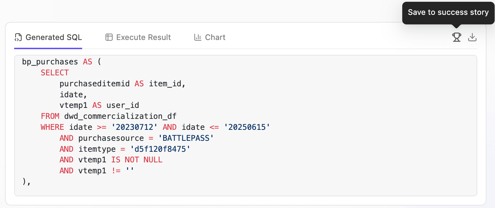

# Web Chatbot User Guide

## Overview

The Datus Web Chatbot provides a user-friendly web interface for interacting with the Datus AI assistant. It serves a React-based frontend (`@datus/web-chatbot`) backed by the Datus Agent FastAPI server, offering an intuitive chat experience for natural language to SQL conversion without requiring command-line knowledge.

## Quick Start

### Launch the Web Interface

**With Datasource**:
```bash
datus --web --datasource <your_datasource>
```

**With Custom Configuration**:
```bash
datus --web --config path/to/agent.yml --datasource <your_datasource>
```

**Custom Port and Host**:
```bash
datus --web --port 8080 --host 0.0.0.0
```

The web interface will automatically open in your browser at `http://localhost:8501` (or your specified port).



## Main Features

### 1. Interactive Chat Interface

**Natural Language Queries**:

Simply type your question in plain language, and the AI will generate SQL and execute it.

**Example**:

```
Show me total revenue by product category for the last month
```

The assistant will:

1. Understand your question
2. Generate the appropriate SQL query
3. Display the SQL with syntax highlighting
4. Show the AI's explanation

### 2. Subagent Support

Access specialized subagents for different tasks directly from the web interface.

**Available Subagents**:

The available list comes from built-in subagents plus any custom entries under `agent.agentic_nodes` for the current database. Common examples include:

- `gen_sql`
- `gen_report`
- `gen_semantic_model`
- `gen_metrics`
- `gen_dashboard`
- `scheduler`

**How to Use**:

1. Open the main chatbot page
2. Switch to the subagent you need
3. Chat with the specialized assistant

**Direct URL Access**:

You can bookmark subagent URLs for quick access:

```
http://localhost:8501/?subagent=gen_metrics
http://localhost:8501/?subagent=gen_semantic_model
http://localhost:8501/?subagent=finance_report
```

You can also launch the web UI directly into a subagent from the CLI:

```bash
datus --web --datasource production --subagent finance_report
```

### 3. Session Management

**View Session History**:

The sidebar shows your recent chat sessions with:

- Session name
- Creation time

**Load Previous Sessions**:

1. Find the session in the sidebar
2. Click the session name
3. Open the session to review its history or continue the conversation

**Session Sharing**:

Each session has a unique URL that can be shared:

```
http://localhost:8501?session=abc123def456...
```

### 4. Success Story Archive

**Mark Successful Queries**:

When the AI generates a SQL query that works well:

1. Review the generated SQL
2. Click the "Save to success story" button
3. The server recovers the actual datasource from that `execute_sql` / `read_query` execution in session history
4. The query is saved to `{agent.home}/benchmark/{datasource}/{subagent}/success_story.csv`

The page URL and currently selected datasource do not determine the storage directory. For example, SQL that actually
ran on `ccks_fund` is saved under `{agent.home}/benchmark/ccks_fund/{subagent}/success_story.csv` even if the page currently
shows `datus_enterprise`. Saving fails closed when history has no datasource or its start/completion events conflict;
the server does not fall back to a default datasource.

The storage root comes from the active `agent.home`. Set `agent.home` in `agent.yml`, or use `--config` to select another
configuration.



**CSV Format**:

```csv
question,sql,datasource_id,source_id,session_id,session_link,subagent_name,timestamp
"Show revenue by category",SELECT ...,ccks_fund,ss_...,abc123...,http://localhost:8501?session=...,chat,2025-01-15T02:30:00Z
```

The API returns a benchmark-relative `storage_key`, such as `ccks_fund/chat/success_story.csv`; it does not expose an
absolute server path.

Legacy CSV files are never moved or deleted automatically. After confirming that every row belongs to one datasource,
copy one explicitly into the isolated layout:

```bash
datus-agent migrate-success-stories \
  --source ~/.datus/benchmark/chat/success_story.csv \
  --datasource ccks_fund \
  --subagent chat
```

Migration deduplicates by `source_id`, is safe to repeat, and leaves the source untouched. It rejects a newer CSV that
declares a different `datasource_id`. The resulting file can be used as the `success_story` input for semantic-model or
metrics KB bootstrap; new-format files must match the bootstrap request's `datasource_id`.

## Summary

The Datus Web Chatbot provides:

- **User-Friendly Interface**: No command-line knowledge needed
- **Subagent Access**: Specialized assistants for different tasks
- **Session Management**: Save, load, and share conversations
- **Success Tracking**: Mark and collect effective queries
- **Easy Sharing**: One-click session link copying
- **Visual Execution**: See step-by-step query generation
- **Multi-Datasource Support**: Switch between databases easily
